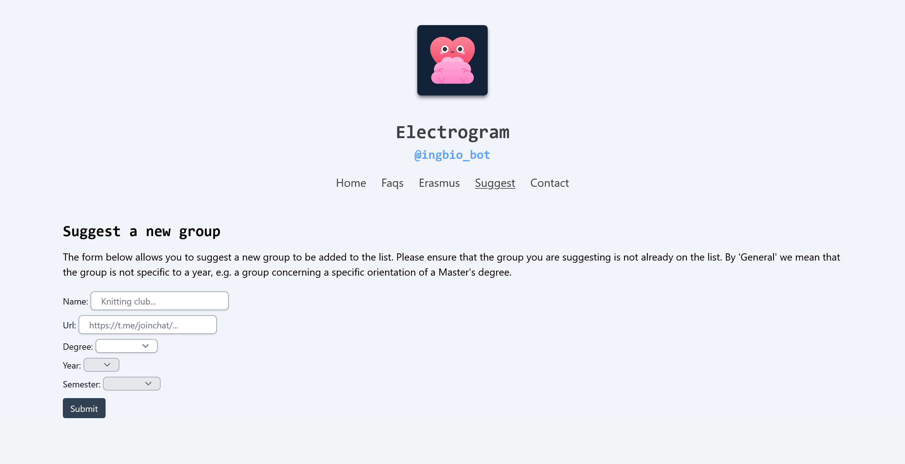
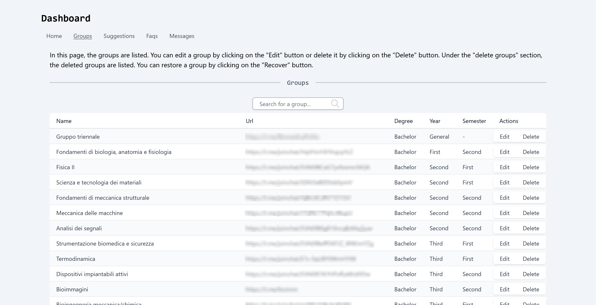

<a name="readme-top"></a>

<!-- PROJECT LOGO -->
<br />
<div align="center">
  <a href="https://github.com/electrogram-project/electrogram">
    
  </a>

<h3 align="center">Electrogram project</h3>

<p align="center">
    <a href="https://electrogram.deno.dev">View Website</a>
    ·
    <a href="https://github.com/electrogram-project/electrogram/issues">Report Bug</a>
    ·
    <a href="https://github.com/electrogram-project/electrogram/issues">Request Feature</a>
  </p>
</div>

<!-- TABLE OF CONTENTS -->
<details>
  <summary>Table of Contents</summary>
  <ol>
    <li>
      <a href="#about-the-project">About The Project</a>
      <ul>
        <li><a href="#built-with">Built With</a></li>
      </ul>
    </li>
    <li>
      <a href="#getting-started">Getting Started</a>
      <ul>
        <li><a href="#prerequisites">Prerequisites</a></li>
        <li><a href="#installation">Installation</a></li>
      </ul>
    </li>
    <li><a href="#screenshots">Screenshots</a></li>
    <li><a href="#contributing">Contributing</a></li>
    <li><a href="#license">License</a></li>
    <li><a href="#contact">Contact</a></li>
    <li><a href="#credits">Credits</a></li>
    <li><a href="#acknowledgments">Acknowledgments</a></li>

</ol>
</details>

<!-- ABOUT THE PROJECT -->

## About The Project

This project consists of a website and an integrated telegram bot. It serves the
purpose of collecting links to telegram groups, FAQs and a small blog with
articles on eramus experiences. The site contains both a page for suggesting the
addition of a new link and a contact page. These two pages can also be reached
from the telegram bot in the form of webapps. The database can be managed
completely through a graphical interface accessible from the website.

### Built With

- [🦕 Deno](https://deno.land/)
- [🍋 Fresh](https://fresh.deno.dev/)
- [💨 Tailwindcss](https://tailwindcss.com/)
- [🤖 grammY](https://grammy.dev/)
- [🔑 DenoKV](https://deno.com/kv)
- [🌱 MongoDB](https://grammy.dev/)
- [⚡️ Supabase](https://supabase.com/)

### Deployed With

- [☁️ Deno Deploy](https://deno.com/deploy)

<!-- GETTING STARTED -->

## Getting Started

To get a local copy up and running follow these simple steps.

### Prerequisites

Install Deno:

- MacOS/Linux

  ```sh
  curl -fsSL https://deno.land/install.sh | sh
  ```

- Windows

  ```sh
  irm https://deno.land/install.ps1 | iex
  ```

Set environment variables:

- Telegram bot token given by Bot Father

  ```sh
  TELEGRAM_BOT_TOKEN=""
  ```

- Website url

  ```sh
  WEBAPP_URL=""
  ```

- MongoDB connection string

  ```sh
  MONGO_URI=""
  ```

- Supabase credentials

  ```sh
  SUPABASE_URL=""
  SUPABASE_KEY=""
  ```

- Telegram channels IDs*

  ```sh
  FAQ_CHANNEL_IDS=""
  ADMIN_CHANNEL_ID=""
  PUBLIC_CHANNEL_ID=""
  ```

_FAQ_CHANNEL is the telegram channel where the FAQs are sent by the user._

_ADMIN_CHANNEL_ID is the telegram channel where the bot sends logs on
administration activities._

_PUBLIC_CHANNEL_ID is the telegram channel where the bot announces the addition
of a new group or FAQ to the list._

### Installation

1. Clone the repo

   ```sh
   git clone https://github.com/electrogram-project/electrogram.git
   ```

2. Run Deno task

   ```sh
   deno task start
   ```

## Screenshots

- Guided suggestion page

  

- Dashboard

  

<!-- CONTRIBUTING -->

## Contributing

Any contributions you make are **greatly appreciated**.

If you have a suggestion that would make this better, please fork the repo and
create a pull request. You can also simply open an issue with the tag
"enhancement". Don't forget to give the project a star! ⭐️

### Translations

The telegram bot menus can easily be translated into other languages by creating
a new file _.ftl_ file and adding it to the `telegram/locales` folder.

<!-- LICENSE -->

## License

Distributed under the Apache License 2.0. See `LICENSE.txt` for more
information.

<!-- CONTACT -->

## Contact

Electrogram team - <electrogram@pm.me>

Project Link:
[https://github.com/electrogram-project/electrogram](https://github.com/electrogram-project/electrogram)

## Credits

All icons used have been created by [Freepik](https://www.flaticon.com/)

<!-- ACKNOWLEDGMENTS -->

## Acknowledgments

The repositories that inspired this project:

- [Supa fresh auth](https://github.com/morlinbrot/supa-fresh-auth)
- [grammY examples](https://github.com/grammyjs/examples)
- [TinyRocket](https://github.com/slamethendry/tinyrocket)
- [Tabler icons tsx](https://github.com/hashrock/tabler-icons-tsx)
- [Best REAME template](https://github.com/othneildrew/Best-README-Template)

<p align="right">(<a href="#readme-top">back to top</a>)</p>

[](https://fresh.deno.dev)
